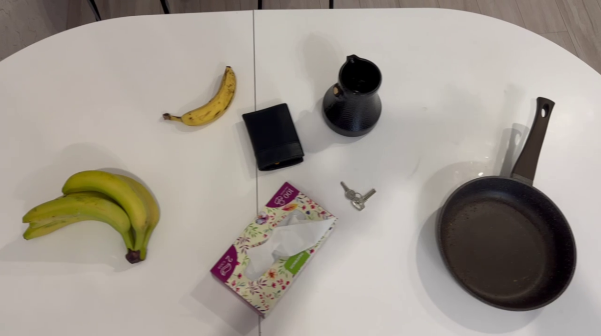
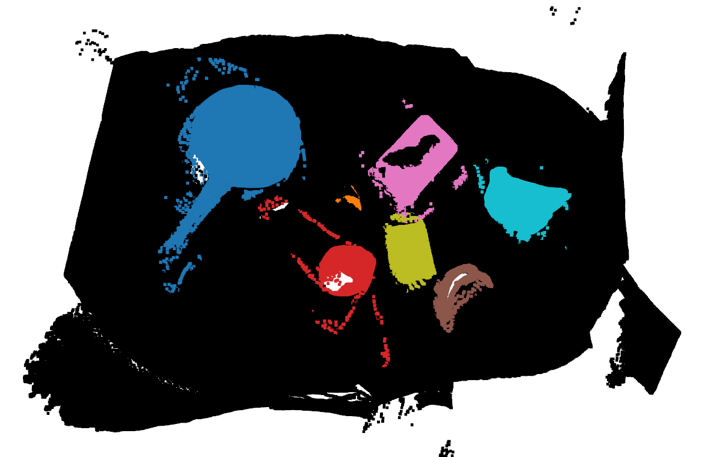
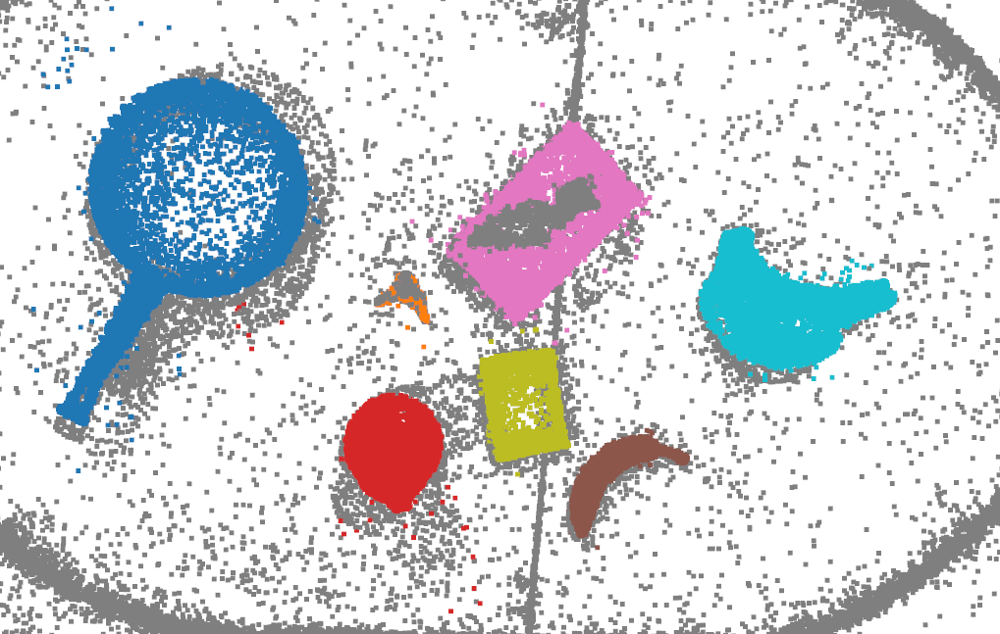

# Object-centric 3D Gaussian Splatting
Unofficial implementation of scene initialization method proposed in [3D-Aware Manipulation with Object-Centric Gaussian Splatting](https://object-aware-gaussian.github.io/).

> Note: test release.
> 
> This code was developed without reliance on RGB-D data, and may differ from the original paper. In particular, depth maps are extracted using [g2mesh](https://gs2mesh.github.io/) for better quality and accuracy when fusing point clouds. Also, sparse initialization is used for 3DGS to work with [gsplat](https://docs.gsplat.studio/main/#).

## Installation

Install dependencies:
```bash
mkdir dependency && cd dependency
git clone https://github.com/yanivw12/gs2mesh.git
git clone https://github.com/IDEA-Research/Grounded-SAM-2.git
```

Follow installation procedure for [Grounded SAM 2](https://github.com/IDEA-Research/Grounded-SAM-2) and [g2mesh](https://github.com/yanivw12/gs2mesh). Please note that these projects were originally tested in different `conda` environments because they require different CUDA and torch versions. 3DGS initialization code was tested in the same environment with Grounded SAM 2.

Install other packages (any environment)
```bash
pip install numpy scipy transforms3d matplotlib opencv-python open3d gsplat
```

# Usage

The setup was tested on footage from IPhone 14 Pro (RGB video). Please change necessary variables in the scripts mentioned below.

<!--  -->
Example image from tested scene:



1. Create initial reconstruction using [g2mesh](https://gs2mesh.github.io/). Follow [this process](https://github.com/yanivw12/gs2mesh?tab=readme-ov-file#custom-data) to initialize data folder. Then, `custom_data.ipynb` notebook can be used to perform reconstruction and extract high-quality depth maps from 3DGS scene.

2. Based on the extracted images, select several views to be used for object detection and segmentation (`selected_images` variable).

3. Use Grounded SAM 2 to extract segmentation masks:
    ```bash
    cp get_object_masks.py dependency/Grounded-SAM-2/
    cd dependency/Grounded-SAM-2/
    python3 get_object_masks.py
    ```

4. Fuse depth maps from selected views and label points in resulting point cloud.
    ```bash
    python3 label_point_cloud.py
    ```

    Example:
    

5. Run `gsplat` on data extracted using `g2mesh` and put results to `g2mesh/data/custom/$SCENE/results/`.
6. Load gaussian means from `gsplat` resulting reconstruction. Run
    ```bash
    python3 label_3dgs.py
    ```
    to assign labels to gaussian means based on labeled point cloud obtained from several views. View `labeled_gs_means.ply` to check label assignment.

    Example (gaussian means with `l=0` are shown in gray):
    
